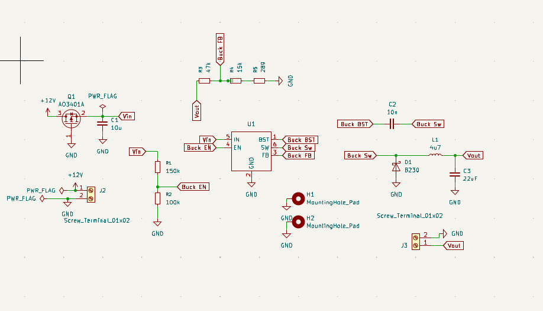
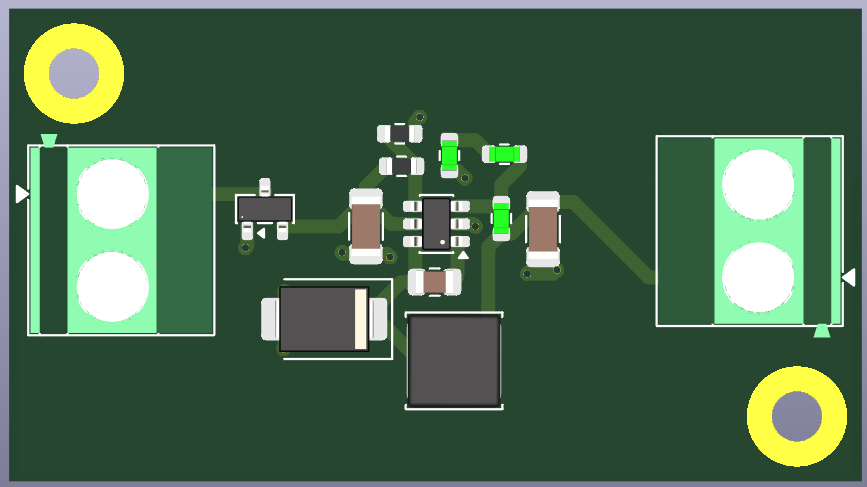

# MP2359-Buck-regulator
This is the first buck regulator I designed following the datasheet as correctly as I could without following any tutorial or anything
Here the voltage can be regulated more efficiently and 12V is stepped down to 3.3V
The enable pin has to have less than 6V for turning the chip on
The feedback resistors help in controlling the output to 3.3V

